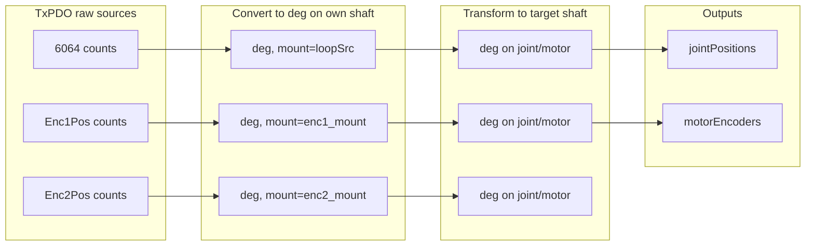

# Dual-encoder handling (CiA‑402 EtherCAT device)

## Summary
How the driver uses two encoders per axis: mounting semantics, loop sources, feedback selection, shaft transforms, and data pipelines.

## Quick reference

Configuration keys parsed in `CiA402MotionControl::open`:

| Key                        | Allowed values                  | Meaning                                 |
|---------------------------|----------------------------------|-----------------------------------------|
| enc1_mount                | `motor`, `joint`                 | Physical location of encoder 1          |
| enc2_mount                | `motor`, `joint`, `none`         | Physical location of encoder 2          |
| position_feedback_joint   | `"6064"`, `"enc1"`, `"enc2"`    | Source for joint position               |
| position_feedback_motor   | `"6064"`, `"enc1"`, `"enc2"`    | Source for motor position               |
| velocity_feedback_joint   | `"606C"`, `"enc1"`, `"enc2"`    | Source for joint velocity               |
| velocity_feedback_motor   | `"606C"`, `"enc1"`, `"enc2"`    | Source for motor velocity               |

Notes:
- `6064` = Position actual value; `606C` = Velocity actual value (details in protocol_map.md).
- If a source is `enc1`/`enc2`, the encoder must be mounted and its PDO must be mapped.

## Drive loop sources
The drive’s control loops run off an internal source selection for position and velocity. The driver reads the “position loop source” and “velocity loop source” SDOs (indices listed in protocol_map.md) to interpret what `6064/606C` refer to. If a loop source is unknown, a conservative fallback is used (prefer Enc1 if mounted, else Enc2).

## Feedback source selection
Validation performed during `open()`:
- If `position/velocity_feedback_*` is `enc1`/`enc2`, that encoder must be mounted and present in the PDO map, otherwise configuration fails.
- If the source is `6064/606C`, values are interpreted in the context of the loop source selection above.

## Shaft transformations
When converting measurements between motor and joint shafts, the driver applies gear ratio–based transforms:

| From → To     | Formula            |
|---------------|--------------------|
| Motor → Motor | deg (unchanged)    |
| Motor → Joint | deg × 1/gearRatio  |
| Joint → Motor | deg × gearRatio    |
| Joint → Joint | deg (unchanged)    |

Same logic applies to velocities.

## Feedback pipeline
Per axis (conceptual):
1. Select source (config).
2. Convert raw → engineering units on the encoder’s own shaft (counts→deg or rpm→deg/s; formulas in protocol_map.md).
3. Transform to the requested shaft (motor/joint) using gear ratio and mounts.
4. Store into thread‑safe variables for YARP interfaces.

Mermaid (position path):

Fallbacks:
- Unknown loop source → prefer Enc1 if mounted.
- Accelerations → always `0.0`.
- Safety/timestamp PDOs are handled when present.

## Command pipeline (overview)
- Velocity mode (CSV): joint deg/s are transformed to the loop shaft and converted to rpm, then written to the velocity target. A first‑cycle latch suppresses non‑zero output.
- Torque/Current mode (CST):
  - Torque path: joint Nm → motor Nm → per‑thousand of rated motor torque (see protocol_map.md for formulas and rated‑torque SDO).
  - Current path: A → motor Nm via torque constant → per‑thousand (see protocol_map.md).
  - On mode or CST‑flavor change, set‑points/latches are cleared to avoid stale outputs.

## Valid config examples
1) Motor encoder only
- enc1_mount=motor, enc2_mount=none
- joint feedback derived from Enc1 with gear ratio inversion.

2) Joint encoder only
- enc1_mount=none, enc2_mount=joint
- motor feedback derived via gear ratio.

3) Dual (classical)
- enc1_mount=motor, enc2_mount=joint
- position_joint=enc2, position_motor=enc1
- velocity_joint=606C (if vel loop source = Enc2), velocity_motor=606C or enc1.

4) Redundant/diagnostic
- both mounted; expose 6064/606C for drive loops, plus direct enc1/enc2 for cross‑checks.

## Edge cases & notes
- gearRatio=0 → invalid; conversions return 0.
- Sign conventions must be consistent externally if mounts imply inversion.
- Backlash detection (motor vs joint encoder) is out of scope.
- PDO rollover is handled; always check presence before reading optional entries.

## Troubleshooting
- Error: invalid config (encX not mounted/mapped) → Fix XML mapping or mounts.
- Joint/motor look identical → Check gear ratio; or both encoders are on the same shaft.
- 6064/606C look wrong → Verify loop source SDOs (indices in protocol_map.md).

## Related
- protocol_map.md — PDO/SDO reference and unit conversions (single source of truth)
- modes_and_setpoints.md — which targets are written per mode and how set‑points are cleared
